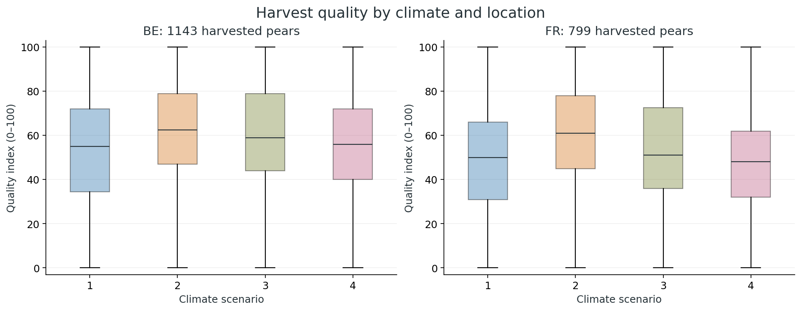
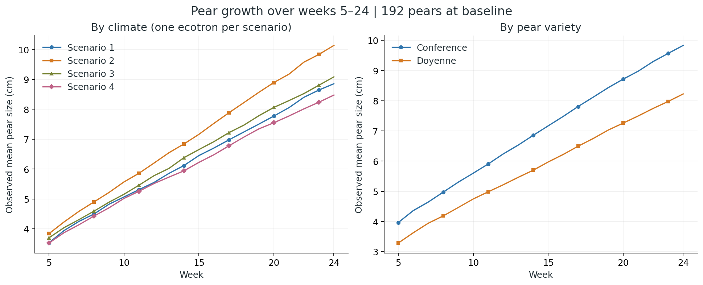
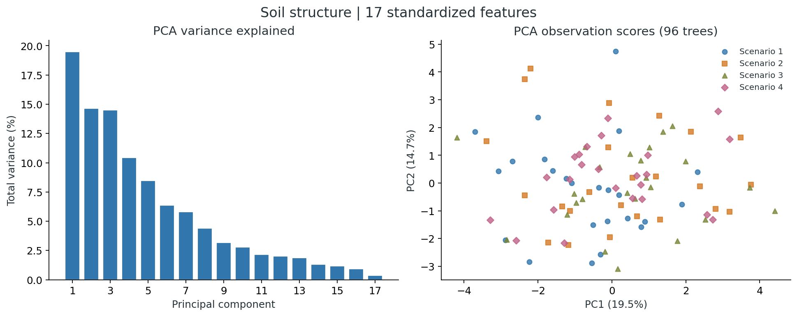

# Pear Quality Under Future Climate Scenarios

**Mixed Models, Longitudinal Growth, and Multivariate Soil Analysis in R and SAS**

How might future climate interventions affect the quality and growth of pears? This project investigates four simulated 2070 climate scenarios using pear quality, repeated size measurements and soil characteristics from an Ecotron teaching study.

The analysis follows the entire statistical workflow: understanding the experimental design, inspecting the data, defining outcomes, accounting for clustered observations, comparing models, examining dropout, and interpreting PCA and LDA. All supplied analysis code and the complete report are included.

**Main finding from the submitted analysis:** Scenario 2, representing active CO₂ removal, showed the most consistent positive associations with pear quality and growth. The growth comparison describes four experimental units, with one ecotron per scenario; it cannot isolate climate effects from ecotron effects.

[Full report](reports/final-report.pdf) · [Step-by-step analysis](docs/analysis-guide.md) · [Data dictionary](data/README.md) · [Reproducibility and corrections](docs/analysis-audit.md)



*Observed harvest quality; boxplots describe the data rather than adjusted model effects. Source: the complete harvest dataset included below.*

## Research questions

| Question | Outcome / inputs | Statistical approach |
|---|---|---|
| Which climate scenario is associated with better harvest quality? | Continuous quality index, 0–100 | Linear mixed model; Gaussian GEE comparisons |
| Which scenario is associated with a greater chance of good quality? | Good quality = index ≥55 | Logistic GLMM; binary GEE with independent and exchangeable working correlations |
| How do climate and variety relate to growth over time? | Pear size in cm, weeks 5–24 | Longitudinal LMM with pear intercepts/slopes and tree intercepts; GEE comparisons |
| Does excluding pears with incomplete follow-up alter the analysis? | All available measurements versus complete pears | Dropout exploration and complete-case sensitivity analysis |
| What structure is present in the soil measurements? | 17 standardized soil variables | PCA, scree plot and biplot |
| Can soil characteristics and pear counts distinguish the climate groups? | Soil features plus pears per tree | LDA, discriminant scores and coefficients |

The original sample-size planning discussion and reported power calculations are preserved in the full report. The project-specific simulation script was not present in the supplied sources; its numerical results are documented as reported, not reconstructed as an original program.

## Study context

The project was completed for **Multivariate and Hierarchical Data / Project Discovering Associations, Hasselt University, 2025–2026, Group 12**.

Ecotrons are controlled environmental units. The assignment considers two pear varieties, **Conference** and **Doyenne du Comice**, under four future scenarios:

| Scenario | Intervention represented |
|---|---|
| 1 | No major intervention; reference scenario |
| 2 | Active CO₂ removal |
| 3 | More sustainable energy production |
| 4 | Transportation interventions |

These are scenarios from an educational project. They are not measurements of the actual climate in 2070.

The harvest and growth datasets have **different designs**. Harvest quality covers 16 ecotrons across Belgium and France, with 96 trees. Repeated size measurements cover 192 pears in four ecotrons and eight trees. Soil measurements cover 96 trees. Treating every pear or every repeated measurement as an independent climate replicate would misrepresent the design.

## Data included

| File | Rows × columns | Observation unit | Purpose |
|---|---:|---|---|
| [G12.outcome.data.csv](data/raw/G12.outcome.data.csv) | 1,942 × 8 | Harvested pear | Continuous and binary quality analyses |
| [G12.size.data.csv](data/raw/G12.size.data.csv) | 192 × 25 | Pear, with 20 weekly columns | Original growth data |
| [G12.soil.data.csv](data/raw/G12.soil.data.csv) | 96 × 23 | Tree | Soil analysis and linkage to pear counts |
| [quality_binary.csv](data/processed/quality_binary.csv) | 1,942 × 9 | Harvested pear | Original export with thresholded outcome |
| [longitudinal_data.csv](data/processed/longitudinal_data.csv) | 3,840 × 7 | Scheduled pear–week | Original long-format export, including missing visits |
| [time_data_clean.csv](data/processed/time_data_clean.csv) | 3,460 × 7 | Pear–week among complete pears | Original complete-case export |

The long dataset contains **3,637 observed measurements and 203 missing measurements**. Of 192 pears, **173 have complete follow-up**. At week 24, 94 Conference and 79 Doyenne pears have observed sizes. These counts and the raw-to-processed transformations were checked directly.

**Naming detail:** the `quality` field in the longitudinal exports is **size in centimetres**. It is not the harvest `quality_idx` endpoint. The original column name is retained for compatibility with the R/SAS code.

## Analysis workflow

### 1. Inspect data and experimental units

Inspect variable types, identifiers, location, species and climate allocations. Check missingness, confirm that each ecotron belongs to one climate, and distinguish the harvested-pear, tree and repeated-measurement units.

### 2. Explore continuous and binary quality

The complete EDA includes distributions by climate, variety and location; subgroup means; interaction plots; the index ≥55 classification; tree-level proportions; and subgroup comparisons. All original R chunks remain available in the [annotated EDA notebook](analysis/r/01-exploratory-analysis.Rmd), alongside its [original rendered PDF](reports/exploratory-analysis.pdf).

### 3. Model harvest quality with clustering

The report's primary continuous model uses climate, variety and location as fixed effects and a tree random intercept. Its logistic counterpart models good-quality odds. GEE comparisons use population-average models with alternative working correlations. The original SAS source also fits tree and ecotron random intercepts; the distinction is documented rather than silently combined into a single model.

### 4. Analyse repeated growth and dropout

Reshape weeks 5–24 into long format. Inspect retention, last observed weeks, descriptive survival curves, mean growth and individual trajectories. The report's longitudinal model includes time-by-climate and time-by-variety terms, a tree random intercept and a correlated pear intercept/slope. Compare all-available and complete-case analyses.



*Observed means, not fitted curves. The number of observed pears declines over time. Climate comparisons are confounded with the four ecotrons.*

### 5. Explore soil structure and discrimination

Standardize the 17 soil measurements before PCA. Examine explained variance, observation scores and loadings. Then join harvest counts to soil using location, ecotron and tree keys. LDA uses the soil variables and pear counts to describe separation between the four climate groups.



*PCA calculated from all 96 soil records. The complete original biplot and every LDA plot are in [soil-analysis.pdf](reports/soil-analysis.pdf); the editable code is in [02-soil-analysis.R](analysis/r/02-soil-analysis.R).*

### 6. Interpret results and limitations

Separate continuous-quality differences, odds ratios and weekly growth-rate differences. Use the correct reference group, account for multiple comparisons, and distinguish exploratory discrimination from validated prediction. The [analysis guide](docs/analysis-guide.md) explains each step and links it to its source.

## Results reported in the submitted analysis

The table below transcribes selected estimates from the submitted report. It is a reading guide; the full model tables, comparisons, covariance estimates and appendices remain in [the report](reports/final-report.pdf). R/SAS model estimates were **not re-fitted** during repository preparation.

| Endpoint | Comparison | Reported estimate | Interpretation |
|---|---|---:|---|
| Continuous quality | Scenario 2 vs 1 | +9.9964 index units | Higher adjusted mean quality |
| Continuous quality | Scenario 3 vs 1 | +5.5843 index units | Higher adjusted mean quality |
| Continuous quality | Doyenne vs Conference | −6.3519 index units | Lower adjusted mean quality |
| Good-quality odds | Scenario 2 vs 1 | OR ≈1.6835 | About 68% higher odds; not 68 percentage points higher probability |
| Good-quality odds | Doyenne vs Conference | OR ≈0.6130 | About 39% lower odds |
| Growth rate | Scenario 2 vs 1 | +0.0515 cm/week | Faster estimated growth in the observed units |
| Growth rate | Doyenne vs Conference | −0.0532 cm/week | Slower estimated growth |
| Soil PCA | PC1 / PC2 / PC3 | 19.5% / 14.7% / 14.5% | Variability spans several dimensions |
| Soil LDA | LD1 / LD2 / LD3 | 59.8% / 23.0% / 17.1% | Relative discriminant strength; not prediction accuracy |

Independent calculations from the supplied raw data reproduce the rounded PCA and LDA proportions. Seven PCs explain **79.80%**, while eight explain **84.20%**: eight are needed if the target is strictly at least 80%.

The binary-model intercept is 0.3028 on the log-odds scale: `exp(0.3028) ≈ 1.3536` odds, corresponding to a **57.51% conditional probability at random effect zero**. The original report's “35.36” wording is not the corresponding probability. Other source discrepancies and their implications are explained in the [audit](docs/analysis-audit.md).

## Repository navigation

| Location | Contents |
|---|---|
| [analysis/r](analysis/r) | Complete annotated EDA R Markdown and recovered PCA/LDA R source |
| [analysis/sas](analysis/sas) | Complete supplied SAS workflow with portable paths; separate report-aligned implementation |
| [archive/original-code](archive/original-code) | Byte-preserved Rmd and SAS originals, plus code extracted from the soil PDF |
| [data](data) | Three raw datasets, all three supplied exports and the data dictionary |
| [reports](reports) | Full report, rendered EDA, soil analysis and SAS code PDF |
| [docs](docs) | Study brief, soil definitions, analysis guide, audit and attribution |
| [results](results) | Data-validation output, full PCA/LDA tables, subgroup and retention tables |
| [figures](figures) | Reproducible README figures |
| [notebooks](notebooks) | Full editable Python data-validation companion |
| [scripts](scripts) | Preparation, rendering and independent verification utilities |

## Run the project

Clone or download this repository and work from its root directory. Open `climate-pear-quality-analysis.Rproj` in RStudio if preferred.

### R: prepare data and render the full exploratory analysis

Install the dependencies once in R:

```r
install.packages(c("rmarkdown", "knitr", "tidyverse", "lattice", "viridis",
                   "naniar", "survival", "Hmisc", "MASS", "scales", "factoextra"))
```

Then run:

```bash
Rscript scripts/render_analysis.R
```

This regenerates the processed datasets, renders the entire EDA notebook to HTML and creates the full soil graphics PDF. R Markdown requires Pandoc, typically supplied with RStudio. The dependency list is not a captured lockfile of the original analysis environment.

To run individual stages:

```bash
Rscript scripts/prepare_data.R
Rscript analysis/r/02-soil-analysis.R
```

### SAS: original workflow and report-aligned models

After data preparation, use an installation with SAS/STAT:

```bash
sas analysis/sas/01-source-workflow.sas
sas analysis/sas/02-report-models.sas
```

For SAS Studio, upload the repository folders, run `scripts/prepare_data.R` in R first, and set `project_root` inside the SAS program to the uploaded repository directory. The first program preserves the supplied statistical specifications. The second implements report equations, missing Gaussian GEE comparisons and explicitly labelled sensitivities; it is **new, unexecuted code**, not a recovered final SAS file. Inspect logs, event coding, class ordering, covariance boundaries and convergence before citing new output.

### Python: verify the data and regenerate README figures

```bash
python -m pip install -r requirements.txt
python scripts/verify_data.py
```

This validates identifiers, domain rules, joins, binary thresholds, dropout patterns and both supplied longitudinal exports. It also recalculates PCA/LDA proportions and regenerates the README figures. It does not replace the R/SAS analyses.

The [validation record](results/validation.json) records 24 passing checks and the actual Python package versions used. Full R Markdown execution and SAS fitting remain unverified in this environment.

## Interpretation boundaries

- **Climate replication:** harvest climate is assigned at ecotron level. The source's tree-only models need comparison with ecotron-aware inference. Longitudinal data have one ecotron per climate, so climate and ecotron are inseparable.
- **Missingness:** keeping incomplete pears in a likelihood analysis relies on an appropriate model and an ignorable missing-data mechanism, commonly MAR. Likelihood does not automatically eliminate dropout bias.
- **LDA:** separation was fitted on the same observations used for display. No held-out predictive performance is claimed. A small pear-count coefficient is not a test that climate has no effect on yield.
- **Source versions:** the report and supplied code differ in several model specifications. Both are preserved, and adaptations are recorded in [analysis-audit.md](docs/analysis-audit.md).

## Contributors and provenance

Original group contributors: **Luu Trong Nghia, Brohi Abdullah Ali, Hossain Tanjim, Andryan David, and Tahri Mohammed**. The EDA source identifies **David Andryan** as its author. This portfolio repository is maintained by **Tanjim Hossain**; it presents the collaborative project and does not assert sole authorship of the group work.

Data and project materials were supplied for the UHasselt course. No independent open-data licence was included in the source materials. The repository does not grant a new blanket licence over course data or collaborator-authored materials. See [provenance](docs/provenance.md).
