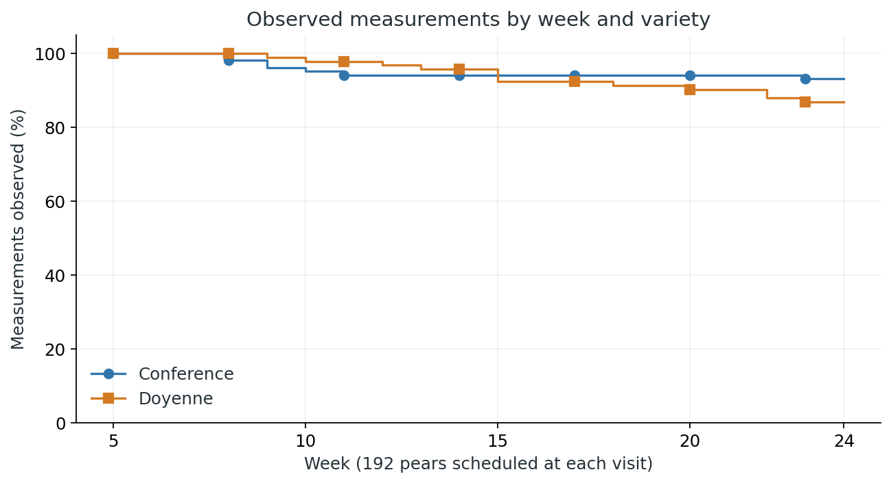
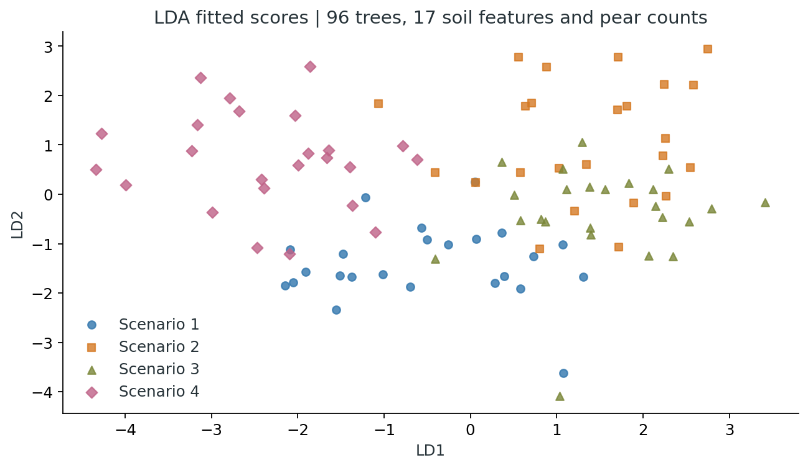

# Complete analysis guide

This guide explains the full workflow and identifies the relevant source for each stage. The editable analysis code, data, portfolio documentation and retained technical outputs are available in this repository. Values described as **reported** come from the submitted study report used during portfolio reconstruction; only the independent data audit and PCA/LDA checks were executed during repository preparation.

## 1. Begin with the design, not the model

Read [the assignment](project-brief.docx). It introduces future climate scenarios, Ecotron experiments, two pear varieties and the aim of selecting a favourable scenario for pear quality. The supplied brief describes experiment planning; the project data and reported study results establish the three subsequent analysis streams.

The harvest design has pears within trees within ecotrons, with ecotrons located in Belgium or France. Climate is constant within an ecotron. Repeated growth data have visits within pears within trees, with each climate uniquely assigned to one of four ecotrons. Soil data contain 17 measurements for each of 96 trees.

These are not interchangeable observation units. Large numbers of pears improve within-unit information but do not create additional independent climate replicates.

## 2. Sample-size planning

The submitted study report describes 10,000 simulations, effect sizes 10, 15 and 20, power targets around 80–90%, and an ICC of 0.20 in its selected planning example. The reported planning table contains:

| Sample size | Reported power |
|---:|---:|
| 400 | 79.41% |
| 450 | 84.27% |
| 500 | 88.56% |
| 550 | 90.89% |

The study documentation discusses 540 pears and a planned total of 2,160 pears, compared with 1,942 observed harvest records. The exact unit of the 540 figure and complete simulation parameterization are not supplied in executable project code. Preserve these as historical planning results; do not claim an independently reproduced power calculation.

## 3. Import, identify and validate

Use [prepare_data.R](../scripts/prepare_data.R) for deterministic preprocessing and [verify_data.py](../scripts/verify_data.py) for the executed checks. No observations are imputed. Raw data stay unchanged.

The validation covers primary-key uniqueness, expected species and climate levels, quality range, allocation consistency, binary thresholding, complete-case membership, all scheduled visits and soil-to-harvest join coverage. The [validation record](../results/validation.json) contains the check results and runtime versions.

## 4. Continuous-quality exploratory analysis

The [EDA notebook](../analysis/r/01-exploratory-analysis.Rmd) retains the full analysis sequence:

1. Inspect harvest structure and column missingness.
2. Plot quality distributions by climate with location colour; by species with location colour; and by location.
3. Plot quality by climate with species colour, including location facets and location means.
4. Draw species-by-climate, species-by-location and location-by-climate interaction plots.
5. Draw group-mean quality trajectories by species and climate with location panels.

These displays describe conditional subgroup patterns. Non-parallel group means can motivate an interaction candidate but do not themselves establish a statistically significant interaction. Likewise, overlapping boxplots do not constitute a test of equality.

## 5. Define and explore good quality

Create `quality_b = as.integer(quality_idx >= 55)`. For each tree, compute the fraction of harvested pears meeting the threshold. The notebook retains the location, climate and species boxplots of tree-level proportions, grouped outcome bars, faceted comparisons and binary interaction plots.

A proportion computed from a tree's records differs from a model-adjusted probability. Tree sizes vary, so averaging tree proportions and pooling all pears need not produce the same number. In the binary bar plots, some displays retain groups that are not mapped to a visible facet; use the fully faceted location-by-species version for unambiguous subgroup interpretation. The analysis sequence is retained for traceability.

## 6. Continuous-quality mixed model

The reported continuous-quality equation models the quality index using climate, species and location, plus a random tree intercept. Conference, Belgium and Scenario 1 define the reference group. The report gives an estimated tree ICC of 0.0084.

The supplied SAS program instead includes both tree-within-ecotron and ecotron random intercepts. Those are different covariance specifications. Both source versions are documented in [the audit](analysis-audit.md).

The reported continuous-quality coefficient comparison is:

| Term | LMM estimate (SE) | GEE independence (SE) | GEE exchangeable (SE) |
|---|---:|---:|---:|
| Intercept | 56.0887 (1.4862) | 56.0504 (1.5937) | 56.0704 (1.5951) |
| Doyenne | −6.3519 (1.1752) | −6.3241 (1.1154) | −6.3389 (1.1222) |
| Scenario 2 | 9.9964 (1.6390) | 9.8645 (1.4969) | 9.9304 (1.5002) |
| Scenario 3 | 5.5843 (1.7082) | 5.6666 (1.9522) | 5.6252 (1.9532) |
| Scenario 4 | 0.4953 (1.8087) | 0.5565 (1.6599) | 0.5264 (1.6586) |
| France | −4.7883 (1.1861) | −4.7134 (1.1952) | −4.7515 (1.1956) |

The reported continuous GEE QIC values are 1949.2754 for independence and 1949.3339 for exchangeable. These are nearly identical; QIC compares specified candidate models fitted to the same endpoint/data and is not a likelihood-ratio statistic.

The supplied workflow exports population-level and conditional fitted values, prints them, and plots predicted quality by climate. Those operations remain in [01-source-workflow.sas](../analysis/sas/01-source-workflow.sas).

## 7. Binary GLMM and GEE

The reported binary model uses a Bernoulli response and logit link with a random tree intercept. Conditional Bernoulli variance supplies the response variability; an additional independent Gaussian residual term is not added to the logit equation.

The reported full coefficient comparison is:

| Term | GLMM estimate (SE) | GEE independence (SE) | GEE exchangeable (SE) |
|---|---:|---:|---:|
| Intercept | 0.3028 (0.1180) | 0.3028 (0.1327) | 0.2999 (0.1326) |
| Doyenne | −0.4894 (0.0931) | −0.4893 (0.0892) | −0.4865 (0.0885) |
| Scenario 2 | 0.5209 (0.1300) | 0.5208 (0.1305) | 0.5151 (0.1301) |
| Scenario 3 | 0.1723 (0.1353) | 0.1724 (0.1533) | 0.1758 (0.1529) |
| Scenario 4 | −0.1506 (0.1447) | −0.1505 (0.1330) | −0.1458 (0.1332) |
| France | −0.3585 (0.0942) | −0.3584 (0.0946) | −0.3544 (0.0943) |

The report gives binary QIC values of 2623.41 (independence) and 2623.34 (exchangeable), and GLMM ICC 0.0002. For an odds ratio, exponentiate a log-odds coefficient. For a probability at a given linear predictor, use `exp(eta)/(1 + exp(eta))`. A GLMM coefficient is conditional on random effects; a GEE coefficient has a population-average interpretation. Their similarity in this dataset does not make the estimands identical.

Inspect the modelled response category. The source program does not explicitly request event 1. The additional report-aligned implementation makes `event='1'` explicit.

## 8. Longitudinal reshaping and dropout

The EDA notebook uses `reshape` to convert 20 weekly columns into `time` and `quality`. It retains all 3,840 scheduled observations, including missing sizes. It then calculates each pear's last observed week and the number remaining at each week, by species and climate.

The notebook includes both tabular retention calculations and step plots, as well as a descriptive Kaplan–Meier curve based on last observed week. The first missing visit is week 8; the earliest last observed visit is week 7. Event-time interpretation depends on which convention is used. The curve is descriptive and does not establish an ignorable missing-data mechanism.

The `na.omit` branch in the R code operates on the wide dataset and removes an entire pear if any visit is missing. Its long export has 173 pears × 20 visits = 3,460 rows. Compare this sensitivity cohort with all available measurements, not simply with missing rows removed.

## 9. Explore growth before fitting

The notebook retains the overall size histogram, mean and median reference lines, weekly mean trajectories with error bars/ribbons, species-specific trajectories, climate-specific trajectories, ecotron and tree panels, tree–ecotron membership table, weekly boxplots and ecotron-level mean plots.

Individual trajectories motivate random intercepts and slopes: pears start at different sizes and change at different rates. The exploratory error bars do not adjust for hierarchical dependence. The adapted notebook counts nonmissing measurements when calculating an ecotron-level standard error and uses ecotron grouping for its connecting lines.

## 10. Longitudinal LMM and GEE

The reported longitudinal equation includes fixed effects for species, climate, time, climate×time and species×time. Tree intercepts allow tree-level deviations. Pear intercepts and slopes allow correlated differences in starting size and growth rate.

The reported coefficient table gives these estimates:

| Term | Estimate | Standard error |
|---|---:|---:|
| Intercept | 2.5056 | 0.0504 |
| Doyenne | −0.3815 | 0.0453 |
| Scenario 2 | −0.0223 | 0.0649 |
| Scenario 3 | 0.0318 | 0.0633 |
| Scenario 4 | 0.0091 | 0.0634 |
| Time | 0.2996 | 0.0036 |
| Time×Scenario 2 | 0.0515 | 0.0047 |
| Time×Scenario 3 | 0.0048 | 0.0045 |
| Time×Scenario 4 | −0.0148 | 0.0045 |
| Time×Doyenne | −0.0532 | 0.0032 |

The climate main effects compare scenarios at time zero, outside weeks 5–24. Climate×time estimates compare growth slopes. For example, the reported Conference slope in Scenario 2 is `0.2996 + 0.0515 = 0.3511 cm/week`; Doyenne's slope in that scenario is `0.3511 − 0.0532 = 0.2979 cm/week`.

The report gives tree-intercept variance 0.0015, pear-intercept variance 0.0419, pear-slope variance 0.0004, intercept–slope covariance −0.0026, and residual variance 0.0525. The reported intercept–slope correlation is −0.6351, consistent with the displayed rounded covariance entries. The negative association concerns the model's time-zero intercept, not necessarily size at week 5.

The supplied `.sas` uses AR(1) structure for the two random coefficients and omits species×time; the partial SAS PDF uses UN. The complete report-aligned equation is implemented separately with UN covariance. Every supplied candidate and both all-available/complete-case branches remain preserved.

The longitudinal GEE source uses normal response, identity link and AR working correlation within pear. Ordinary GEE with dropout is not automatically protected under MAR; the likelihood-based rationale must be understood with its assumptions.

## 11. Model comparison and diagnostics

The study compares model specifications using likelihood-based criteria and contrasts, and compares GEE working correlations with QIC. For fixed-effect comparisons using LMM likelihoods, fit comparable models with ML, not differing REML fixed-effect spaces. Variance-component boundary tests require appropriate reference distributions.

For climate-versus-reference contrasts, the reported workflow uses Bonferroni `0.05/3 ≈ 0.0167`. An omnibus equality test is distinct from an explicitly one-sided superiority hypothesis. Inspect the actual contrast signs and modelled event before interpreting a test as superiority.

The new [report-aligned SAS program](../analysis/sas/02-report-models.sas) adds explicit residual-versus-fitted and Q–Q plots for the continuous outcomes. These are additional diagnostics, not claimed completed steps of the historical analysis. SAS logs and model fits must be reviewed when the code is executed. Similar standard errors do not prove a covariance structure is correct.

## 12. PCA on standardized soil measurements

The full code in [02-soil-analysis.R](../analysis/r/02-soil-analysis.R) was recovered from the soil-analysis PDF, preserving every code block. Remove the six metadata variables, then use `prcomp(..., center=TRUE, scale=TRUE)` on the 17 numeric features.

For sample-standardized matrix Z, SVD gives `Z = U D Vᵀ`. The principal scores are `U D`; loadings are columns of V; eigenvalues are `D²/(n−1)`. Explained variance is each eigenvalue divided by their sum, which is 17 for these standardized variables.

The analysis includes a scree plot and biplot. A dot's position is calculated from an observation's scores, never assigned randomly. Arrows describe variable directions in the displayed projection. Their interpretation depends on the biplot scaling, and a 2D plot only represents the first two components.

The independent audit exports all 17 eigenvalues, all 17 score dimensions and all loading columns. PC1 explains 19.5%, PC2 14.7% and PC3 14.5%. PC1–PC2 capture about 34.2%. Seven PCs capture 79.80%; eight capture 84.20%. Overlap in two dimensions does not prove equality of the full multivariate distributions.

## 13. LDA with soil and pear counts

Count harvested pears per tree, join counts to the soil data, remove identifiers/group labels from predictors, and standardize the 18 predictors. Fit LDA with climate as the group label. The workflow displays discriminant strength, LD1–LD2 scores and all LD1 coefficients.

The three discriminant proportions are approximately 59.8%, 23.0% and 17.1%. With four classes there can be at most three discriminant directions. These proportions describe relative discriminant strength; they are not explained total soil variance or model accuracy. Axis signs can flip between implementations without changing the separation.

LDA is supervised and optimized to separate the labelled training observations. The project does not supply cross-validated or held-out accuracy. A prediction extension would need ecotron-aware evaluation so that trees from the same ecotron do not leak across training and validation. The small pear-count coefficient in LD1 is not a test of equal yield across climates.

## 14. What the evidence supports

The project analysis identifies Scenario 2 as the most consistently favourable scenario for quality and growth in its fitted models. Scenario 3 has a positive continuous-quality contrast, without comparable evidence across every endpoint. Soil variation is spread across multiple components; fitted LDA displays some group separation.

Interpretation must retain ecotron-level assignment, the lack of growth replication within climate, dropout assumptions, in-sample LDA evaluation and the source-code/report differences. Detailed reported estimates and source discrepancies are transcribed and discussed in this guide and the [audit](analysis-audit.md).
